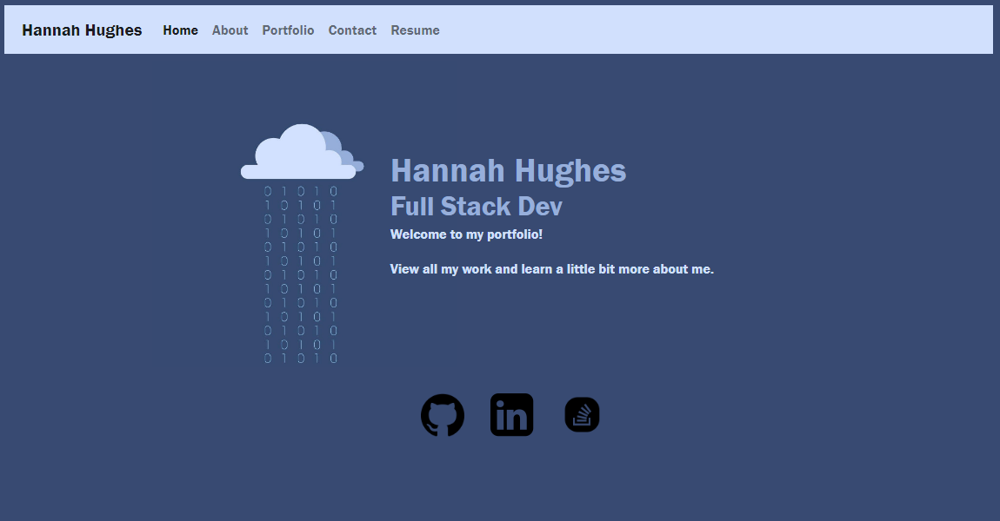
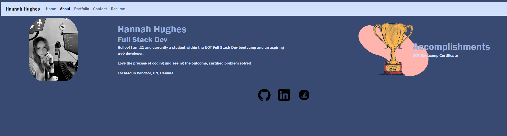
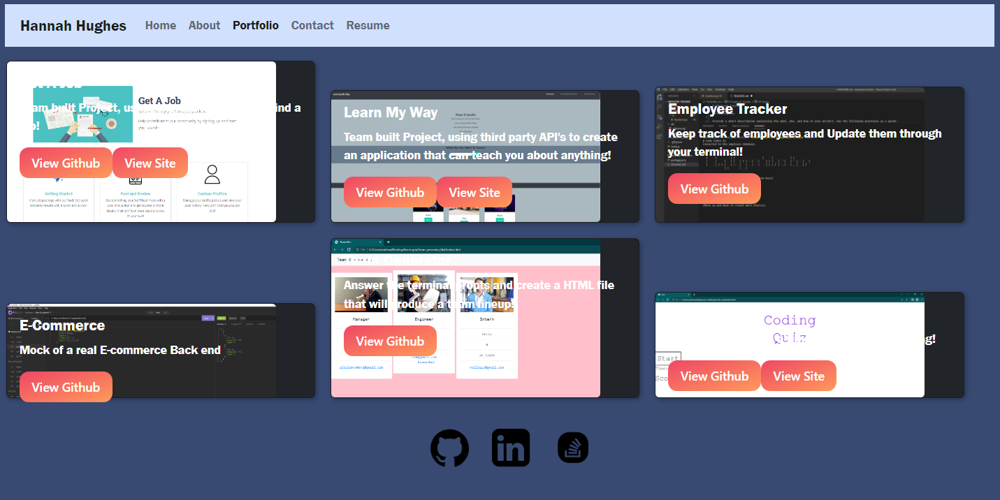
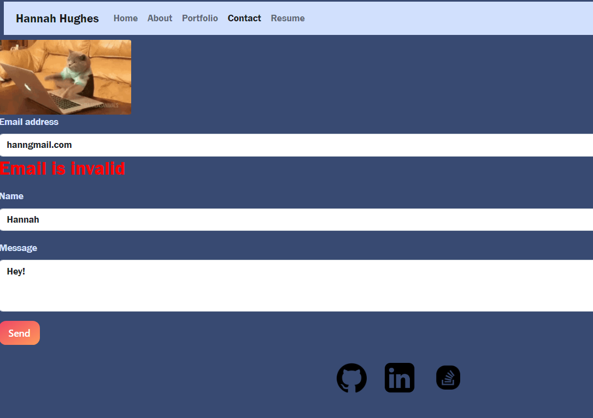
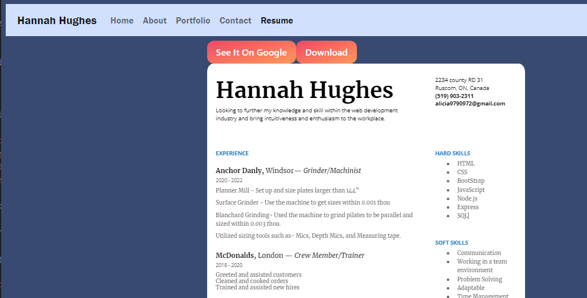

# <Portfolio>

## Description

This is my personal portfolio. Created to have a personal and profesional place to store and show off my projects. My motivation was to try and showcase my strong suits and dedication my new career choice. Also to track my oldest (worst) to new and and improved coding skills I will gain over time. This will allow future employers to view (hopefully be impressed) and potentally hire me. Throughout this challenge I learned about starting code from scratch, implementing cleaning up repetative code, implementing react and a whole new way of deployment.

## Table of Contents (Optional)

- [Installation](#installation)
- [Usage](#usage)
- [Credits](#credits)
- [License](#license)

## Installation

No install required just follow the link and explore!

site: https://hannahhue.github.io/react-portfolio/

## Usage

Once loaded into the home page

You can navigate to the about,

portfolio to view my projects,

contact to reach out to me,

or my resume!

## Credits

Github: https://github.com/hannahhue/react-portfolio

Hannahhue: https://github.com/hannahhue

## License

MIT License

Permission is hereby granted, free of charge, to any person obtaining a copy of this software and associated documentation files (the "Software"), to deal in the Software without restriction, including without limitation the rights to use, copy, modify, merge, publish, distribute, sublicense, and/or sell copies of the Software, and to permit persons to whom the Software is furnished to do so, subject to the following conditions:

The above copyright notice and this permission notice shall be included in all copies or substantial portions of the Software.

THE SOFTWARE IS PROVIDED "AS IS", WITHOUT WARRANTY OF ANY KIND, EXPRESS OR IMPLIED, INCLUDING BUT NOT LIMITED TO THE WARRANTIES OF MERCHANTABILITY, FITNESS FOR A PARTICULAR PURPOSE AND NONINFRINGEMENT. IN NO EVENT SHALL THE AUTHORS OR COPYRIGHT HOLDERS BE LIABLE FOR ANY CLAIM, DAMAGES OR OTHER LIABILITY, WHETHER IN AN ACTION OF CONTRACT, TORT OR OTHERWISE, ARISING FROM, OUT OF OR IN CONNECTION WITH THE SOFTWARE OR THE USE OR OTHER DEALINGS IN THE SOFTWARE.
